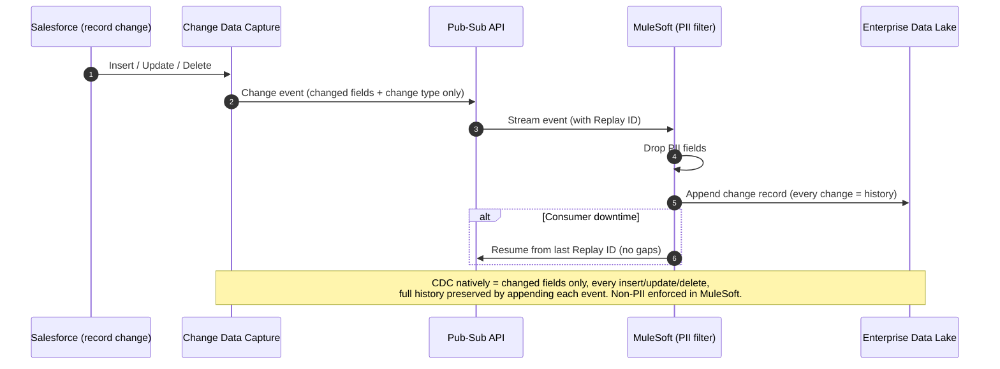
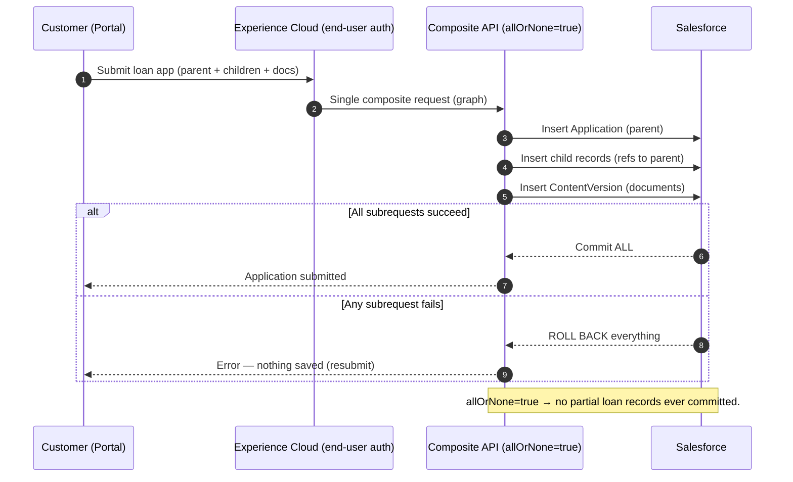

# Bedrock Integration Badge — Defense Brief & Q&A Prep

> Companion to `bedrock-integration-badge-SLIDES.md`. This is **for you, not the slides** — it arms you to defend every decision in the 15-min Q&A.
> Sections: (A) How the solution scores against the rubric · (B) Per-interface "why this, not that" · (C) Error handling per pattern · (D) Three flow diagrams for the hard cases · (E) Anticipated judge questions + model answers · (F) The 5 Integration Patterns cheat-sheet.

---

## A. Rubric coverage map — where the points are and how we earn them

| Rubric objective | Weight | Where we score it |
|---|---|---|
| Identify business requirements & challenges | 5% | Problem Statement slide groups the 3 journeys + cross-cutting mandates |
| Leverage platform features appropriately | 10% | PE, CDC, Salesforce Connect, Composite, Bulk, Continuation, Canvas — each used where it's *the* right tool |
| Articulate solution design | 5% | One-liner thesis + landscape diagram + narrated decision logic |
| **Correct integration pattern per use case + justify** | **20%** | Interface List maps all 16 to the 5 canonical patterns; §B justifies each vs. alternatives |
| Key security considerations (cloud integration) | 5% | Security slide: mTLS, end-user OAuth, Shield, DMZ |
| **Salesforce APIs (REST/SOAP/Bulk/Streaming) + when** | **15%** | REST (INT02/08/09), Bulk (INT03/15), Streaming=Pub-Sub/CDC (INT05/16), Composite (INT12); §F contrasts them |
| **Event-driven (Platform Events + CDC)** | **10%** | PE: INT01/07/11/14; CDC: INT05/16/15-sync — and *why PE vs CDC* in §B |
| **Real-time & async callouts: declarative (Flow HTTP) vs Apex** | **10%** | Flow HTTP Callout INT04; Apex Continuation INT06; §E Q4 |
| **Data virtualization (Salesforce Connect) + UI integration** | **10%** | Salesforce Connect/OData INT10; Canvas INT13; mashup INT04 |
| Trade-offs, considerations, alternatives | 5% | §B alternatives + §E |
| Error handling per pattern | 5% | §C table |

**Takeaway:** 20+15+10+10+10 = **65% of the score is pattern + API + events + callouts + virtualization.** Spend your airtime there.

---

## B. Per-interface rationale — "why this pattern, not the alternative"

**INT01 — Leads MC→SF (Platform Event, fire-and-forget).** Near-real-time + "swarm a team" = a *notification*, not a request needing a reply. PE decouples Marketing Cloud from Salesforce processing so a campaign burst can't throttle MC. *Rejected:* synchronous REST (couples systems, MC waits); polling (latency, wasted calls).

**INT02 — Drupal prospect form→SF (REST, remote call-in).** Volume is 100s→1000+/2yr — tiny. A simple synchronous REST insert of a Lead is correct. *Rejected:* Bulk API (built for thousands+/batch — overkill here); events (no decoupling benefit for a single user-submitted record).

**INT03 — Call lists (Bulk API 2.0 + off-platform compute).** The complaint is *run times getting longer, SLA risk.* Root cause: heavy demographic/geo rules logic. Fix = keep the **business rules engine off-platform** (it already exists) and **Bulk-load** the computed lists daily. Bulk API 2.0 is purpose-built for high-volume scheduled upserts. *Rejected:* doing the compute in Apex batch (governor limits, the very SLA problem); row-by-row REST (far too slow at this volume).

**INT04 — Call-list map (Flow HTTP Callout / LWC mashup).** Pure read, nothing persisted, user-facing. A **declarative Flow HTTP Callout** (or LWC calling a map API via Named Credential) is the lightest tool and shows declarative-callout knowledge (10% rubric). *Rejected:* storing geocodes (unnecessary copy); Apex (works, but declarative is simpler and rubric-relevant).

**INT05 — Manager live update (CDC / PE + Pub-Sub API).** "The moment the rep closes a high-value call" = push on data change. **CDC** on the call/case record (or a PE) streamed to the manager's screen via **Pub-Sub API / empApi** = zero polling. *Rejected:* page auto-refresh/polling (latency, load); report refresh (not real-time).

**INT06 — Credit checks (Apex Continuation → MuleSoft scatter-gather, OIDC). THE crown jewel.** Requirements decoded: synchronous (rep waits), ≤1 min, 30 concurrent, 3+ agencies compared, pluggable, *partial retry of only failed agencies*, per-agency error message. → **Remote Process Invocation – Request & Reply.** Use **Apex Continuation** so the long (≤60s) callout doesn't hold a server thread (scales to 30 concurrent). **MuleSoft Process API does the scatter-gather** across agencies and normalizes responses → adding an agency = MuleSoft change, **zero Salesforce change** (the "flexible to expand" requirement). **OpenID Connect** for agency auth. Partial-retry = MuleSoft tracks per-agency status; resubmit re-invokes only failures (idempotent). *Rejected:* synchronous Apex HTTP callout (holds thread, won't scale to 30 concurrent long calls); calling 3 agencies directly from Apex (tight coupling, no easy expansion, no central retry); future-proofing in Apex (belongs in middleware).

**INT07 — Registered customer → Customer Master + Position Master (PE, fire-and-forget).** One business event ("customer registered") with **multiple consumers** (Hadoop, Position Master, SF) → publish once, fan out. Classic PE use. *Rejected:* multiple point-to-point callouts (N couplings, no decoupling); CDC (this is a business milestone, not just a record-field delta — PE carries a purposeful payload).

**INT08 — Provision Experience Cloud user (REST/Connect call-in).** Customer Master triggers user creation + activation + invite. Remote call-in via REST, can be chained off the INT07 event. *Rejected:* manual (not scalable); Bulk (single record).

**INT09 — Headless self-service Drupal/mobile (Experience Cloud + REST/UI API, end-user OAuth).** Hard constraints: Communities **UI not used** (headless), and access must be **end-user authenticated, not an API user.** → Experience Cloud as the *security/data layer*, surfaced through **REST/Connect/UI API**, with **OAuth 2.0 authorization-code** so each call runs in the customer's context (sharing/FLS enforced). *Rejected:* API/integration user (explicitly forbidden by security team); standard Communities LWR UI (explicitly not used).

**INT10 — Transaction history (Salesforce Connect + OData; MuleSoft cache at scale). THE virtualization answer.** History lives in core banking, exposed via **OData** — and Salesforce Connect speaks OData natively as **External Objects** = real-time read, **no data copied** into Salesforce (avoids storing 100M txns/day). The >100k calls/hr holiday spike is the trade-off: front the OData source with a **MuleSoft caching/gateway layer** (and/or Salesforce Connect's external-object caching) so the core banking system isn't hammered. *Rejected:* replicating transactions into Salesforce (massive storage, sync lag, pointless — SF isn't the master); ETL nightly (not real-time, stale balances).

**INT11 — Customer info updates → Customer Master (PE/CDC, fire-and-forget).** Self-service edits must propagate to the master. PE (or CDC on Contact/Account) → MuleSoft → Hadoop, near-real-time. *Rejected:* synchronous write-through (couples portal save to Hadoop availability).

**INT12 — Loan application (Composite Graph / `allOrNone=true`). THE transactional answer.** Parent Application + child objects + documents must commit **atomically — full rollback on any failure.** **Composite API with `allOrNone=true`** (or Composite Graph) executes the whole tree in one transaction; any subrequest fails → everything rolls back. *Rejected:* sequential REST calls (partial commits — exactly what they fear); Bulk (no cross-object atomicity).

**INT13 — Trading desk no-swivel (Salesforce Canvas + auto-log).** "Leverage external system without swiveling" + "automate logging" = embed the external app **inside** the Salesforce console and capture the interaction. **Canvas** with signed-request SSO embeds the external screen/process flows; an action logs the interaction to a Salesforce object → better AHT & CSAT. *Rejected:* iframe without SSO (re-login = swivel); rebuilding the external flows in SF (huge, defeats "leverage existing").

**INT14 — Loan-processing events at millions/day (High-Volume Platform Events).** Explicit: "millions of events/day, large-scale async." **High-Volume Platform Events / Pub-Sub API** are engineered for exactly this; replay IDs allow recovery. *Rejected:* CDC (tied to record changes, less control of payload/volume semantics); synchronous (impossible at this scale).

**INT15 — RockStar migration + 3-mo bi-di sync (Bulk + CDC/Batch).** Two distinct needs: **(a) one-time migration** = **Bulk API 2.0**; **(b) 3-month bidirectional sync** = SF→RockStar via **CDC**, RockStar→SF via remote call-in/scheduled batch through MuleSoft, with a **conflict-resolution policy** (source-priority or last-writer-wins). Decommission at 3 months. *Rejected:* keeping point-to-point custom sync (no central monitoring/retry — use the backbone); one-directional (requirement says few txns still happen in RockStar).

**INT16 — Salesforce → Data Lake delta (Change Data Capture). THE CDC showcase.** Requirements are a *literal description of CDC*: capture **inserts, updates, deletes**, keep **full history of changes** (not just latest), sync **only changed fields**, **non-PII** only. **CDC** emits exactly that — change events with only changed fields + change type, every change (so history is preserved if the consumer persists each event). Stream via Pub-Sub API → MuleSoft → Data Lake, filtering PII. *Rejected:* nightly Bulk export (loses intermediate history, sends all fields, can't easily express deletes); custom triggers writing an audit table then ETL (reinvents CDC).

---

## C. Error handling per pattern (rubric 5% — have an answer for each)

| Pattern | Interfaces | Error handling |
|---|---|---|
| **Request & Reply (sync)** | INT06, INT09 | Timeout + user-facing error ("Agency XYZ unavailable"); **idempotent partial retry** (only failed agencies); circuit breaker per agency in MuleSoft |
| **Fire-and-Forget (PE)** | INT01, INT07, INT11, INT14 | Subscriber retry on unhandled exception (PE redelivery); **replay ID** to resume after downtime; **DLQ / admin error queue** for poison messages |
| **Batch** | INT03, INT15-load | Bulk job result file → failed rows requeued; restartable; admin retry queue |
| **Data virtualization** | INT10 | Graceful degradation if OData source down (cached/last-known + clear "live data unavailable"); MuleSoft retry/cache; timeouts |
| **CDC** | INT05, INT16, INT15-sync | **Replay ID** to resume from last processed event (no gaps); idempotent consumer; DLQ for failed deliveries; gap handling on overflow |
| **UI integration** | INT04, INT13 | Callout timeout + friendly fallback (INT04 map); Canvas auth-failure fallback (INT13) |
| **Composite all-or-none** | INT12 | `allOrNone=true` → automatic full rollback; return aggregated subrequest errors to the user |

**The cross-cutting requirement:** *"integration errors should be queued for an Administrator to correct and retry."* → A **central DLQ / error-hospital** in MuleSoft (Anypoint) with an admin console; failed events/messages parked, correctable, replayable. Mention this explicitly — it's a stated requirement.

---

## D. Flow diagrams for the hard cases

### D.1 — INT06 Credit check: Continuation + scatter-gather + partial retry

```mermaid
sequenceDiagram
    autonumber
    participant REP as Rep (Salesforce UI)
    participant APX as Apex Continuation
    participant MULE as MuleSoft Process API
    participant A1 as Agency 1
    participant A2 as Agency 2
    participant A3 as Agency 3

    REP->>APX: Run credit check (customer)
    APX->>MULE: Async request (Continuation frees thread)
    par Scatter-gather (parallel)
        MULE->>A1: Credit request (OIDC)
        MULE->>A2: Credit request (OIDC)
        MULE->>A3: Credit request (OIDC)
    end
    A1-->>MULE: Score OK
    A2-->>MULE: Score OK
    A3-->>MULE: TIMEOUT / unavailable
    MULE-->>APX: Partial result (A1,A2 ok; A3 failed)
    APX-->>REP: Show scores + "Agency 3 unavailable — Retry"
    REP->>APX: Resubmit
    APX->>MULE: Retry ONLY failed (A3) — idempotent
    MULE->>A3: Credit request
    A3-->>MULE: Score OK
    MULE-->>APX: A3 complete
    APX-->>REP: All scores compared
    Note over APX,MULE: Continuation = scales to 30 concurrent long calls<br/>without holding server threads. Adding Agency 4 = MuleSoft-only change.
```

### D.2 — INT16 Salesforce → Data Lake via CDC (changed fields + full history)



### D.3 — INT12 Loan application: atomic all-or-none



---

## E. Anticipated judge questions + model answers

**Q1. Why MuleSoft — isn't that over-engineering? Could you do this natively?**
*A:* Three requirements explicitly demand it: **central monitoring**, **reusable integration assets / connection-template library**, and **errors queued for admin retry**. Those are middleware capabilities. MuleSoft also abstracts the credit agencies (add #4 with no Salesforce change) and offloads the 100k/hr OData spike via caching. I still chose the **native Salesforce pattern for each interface** — MuleSoft is the conduit and governance layer, not a replacement for platform features. If the EA group standardizes on another iPaaS, the patterns are identical.

**Q2. Why Platform Events for some flows but CDC for others?**
*A:* **CDC** when the trigger *is a record change* and I want field-level deltas/change-type for free — INT16 (Data Lake: changed fields, inserts/updates/deletes, history) and INT05/INT15-sync. **Platform Events** when it's a **business event with a purposeful payload and multiple consumers**, decoupled from any single object — INT01 (lead swarm), INT07 (customer registered → fan out), INT14 (loan events at millions/day, high-volume PE). Rule of thumb: *"Did a record change?" → CDC. "Did something happen that others care about?" → PE.*

**Q3. 100,000+ transaction-history calls per hour — how does Salesforce Connect survive that?**
*A:* Salesforce Connect virtualizes (no copy), but every external-object query hits the OData source live, so at 100k/hr the **core banking system** is the bottleneck, not Salesforce. Mitigation: front OData with a **MuleSoft caching/gateway layer** (cache recent balances/history with a short TTL), use Salesforce Connect's **external-object caching**, and apply **rate-limiting**. If holiday spikes still threaten the core, selectively **materialize hot data** (recent N days) while virtualizing the long tail. The point: don't copy 100M txns/day; cache the reads.

**Q4. The map and the credit check are both callouts — why declarative for one and Apex for the other?**
*A:* The map (INT04) is a simple, stateless, read-only call with nothing persisted → a **Flow HTTP Callout** (declarative) is the least-cost tool and the right altitude. The credit check (INT06) is a **long (≤60s) synchronous call, 30 concurrent, with scatter-gather and partial-retry logic** → that needs **Apex Continuation** to avoid holding server threads and to orchestrate retry state. Match the tool to complexity: declarative until logic/scale forces code.

**Q5. How do you guarantee the loan application never half-commits?**
*A:* **Composite API with `allOrNone=true`** (or Composite Graph) — the parent, all children, and document inserts run in **one transaction**; any subrequest failure rolls back the entire set. The customer never gets an orphaned partial loan. (Diagram D.3.)

**Q6. The credit-check resubmit — how do you retry only the failed agency?**
*A:* MuleSoft tracks **per-agency status** in the scatter-gather. The response to Salesforce flags which agencies failed. On resubmit, Apex passes the prior request/correlation ID; MuleSoft **re-invokes only the failed agencies** (idempotent by request ID), leaving successful scores intact. The rep sees "Agency XYZ unavailable — Retry," exactly as required. (Diagram D.1.)

**Q7. "End-user authenticated, not an API user" — what does that mean concretely?**
*A:* The Drupal/mobile front end uses **OAuth 2.0 authorization-code** flow against Salesforce (via the IdP). Every API call to Experience Cloud then runs in **that customer's user context**, so **sharing rules and FLS are enforced** per user — a customer can only see their own data. We never use a single shared integration/API user (which would bypass per-user security and break auditability). This satisfies the security team's explicit rule.

**Q8. How is mutual authentication actually implemented?**
*A:* **Two-way TLS (mTLS)** terminated at the **Anypoint gateway in the DMZ** — both client and server present certificates. For **Salesforce-initiated** callouts, **Named Credentials configured with client certificates** provide the Salesforce side of mTLS. Certs are stored in a cert store and rotated. OAuth/OIDC sits on top for identity. So: mTLS for channel/mutual auth, OAuth/OIDC for identity.

**Q9. RockStar — why keep it live 3 months, and how do you avoid sync conflicts?**
*A:* Business keeps RockStar live as a fallback while users transition, and a few transactions still occur there — so it's **bi-directional**, not a one-way migration. SF→RockStar via **CDC**, RockStar→SF via scheduled batch/remote call-in through MuleSoft. Conflicts are resolved by a **defined policy** — source-of-truth precedence per field or last-writer-wins with timestamps — and surfaced to the error queue when ambiguous. At 3 months, RockStar is decommissioned and the sync interfaces retired.

**Q10. Why is the call-list compute off-platform? Isn't that avoiding the problem?**
*A:* The complaint is *Apex/Salesforce run times growing and risking the SLA*. The complex demographic/geo/availability rules are a **compute problem, not an engagement problem** — running them in Apex hits governor limits and is the cause of the slowdown. The **business rules engine already exists**; let it compute off-platform and **Bulk-load** the finished prioritized lists into Salesforce daily. Salesforce displays and acts on the lists; it doesn't grind them out. This removes the SLA risk at the root.

**Q11. What are the biggest risks / what would you do differently with more time?**
*A:* (1) **OData source scalability** at 100k/hr is the top risk — I'd load-test core banking + the cache early. (2) **CDC delivery guarantees / replay** for the Data Lake — ensure the consumer is idempotent and persists each event for true history. (3) **Credit-agency SLAs** — the 1-min ceiling depends on the slowest agency; circuit breakers and per-agency timeouts protect the rep experience. (4) Confirm the **PII classification** is reliable before trusting the Data Lake filter.

---

## F. The 5 canonical integration patterns (Salesforce Integration Patterns & Practices) — cheat-sheet

| Pattern | When | This scenario |
|---|---|---|
| **Remote Process Invocation — Request & Reply** | SF calls out and **needs the response now** | INT06 credit check (Continuation), INT04 map |
| **Remote Process Invocation — Fire & Forget** | SF triggers a remote process, **doesn't wait** | INT01, INT07, INT11, INT14 (Platform Events) |
| **Batch Data Synchronization** | **High-volume**, scheduled, bulk import/export | INT03 call lists, INT15 migration (Bulk API) |
| **Remote Call-In** | **External system calls into Salesforce** (CRUD) | INT02, INT08, INT09, INT12 (REST/Composite), INT15 RS→SF |
| **UI Update Based on Data Changes** | UI reflects backend change **in real time** | INT05 manager dashboard (CDC/PE + Pub-Sub) |
| *+ Data Virtualization* (often cited as 6th) | Read external data **without storing it** | INT10 transaction history (Salesforce Connect/OData) |

**API selection one-liners (15% rubric):**
- **REST** — single/few records, mobile/web, simple CRUD → INT02, INT08, INT09.
- **SOAP** — legacy/contract-first, formal WSDL (none strictly required here; mention you'd use it if a backend mandates SOAP).
- **Bulk API 2.0** — 1000s–millions of records, async batch → INT03, INT15-load.
- **Streaming / Pub-Sub API (Platform Events, CDC, generic events)** — real-time push, event-driven → INT01/05/07/11/14/16.
- **Composite API** — multiple related calls in **one transaction / all-or-none** → INT12.

> **If you remember nothing else walking in:** name the **5 patterns**, map each interface to one, and defend the **three crown jewels — INT06 (Continuation + scatter-gather + partial retry), INT12 (Composite all-or-none), INT16 (CDC for changed-fields/history)**. That's where 65% of the score lives.
