# Bedrock Financial Services — Integration Architecture Domain Badge
## Presentation Content (mapped 1:1 to the official template)

> Maps to `Integration Architecture Badging Presentation Template.pptx`. Slide titles below match the template.
> Keep the **core solution to ~5 slides** (template guidance) — Architecture, Assumptions, Interface List, Security, Summary. Intro/Agenda are scaffolding.
> Diagrams are Mermaid — render in VS Code/Notion/GitHub, export PNG/SVG, paste onto slides.
> **Audience: the customer's Enterprise Architecture Group.** Speak patterns + trade-offs, not clicks.

---

## SLIDE 1 — Title
**Bedrock Financial Services — Integration Architecture**
Proposed Solution Design · Presented to the Enterprise Architecture Group
*[Your name / title / email]*

---

## SLIDE 2 — Agenda
- Introduction (elevator pitch)
- Problem Statement
- Proposed Solution — Architecture · Assumptions · Interfaces · Security
- Summary

---

## SLIDE 3 — Introduction *(personalize)*
- *[Your bio: integration/Salesforce architecture experience, FS domain, prior large-scale integration programs.]*
- One line establishing credibility on **event-driven + API-led integration at FS scale and security.**

> *Speaker notes:* 30 seconds. Land that you've done high-volume, secure, regulated-industry integrations — that's what earns trust with an EA group.

---

## SLIDE 4 — Problem Statement

**Bedrock Financial Services (BFS) must integrate Salesforce into a complex, master-data-fragmented landscape — in real time, securely, and at scale.**

- **Fragmented master data:** Customer Master = **Hadoop** (EA-managed, partly outsourced, multi-channel: real-time/batch); **Position Master** = separate trading system; **Salesforce** masters Chatter, Opportunities, Leads, Cases. A **multi-petabyte warehouse** holds decades of transaction history.
- **Scale:** 5M customers · ~10M accounts · **~100M transactions/day** · 150 Sales reps · 500 CSRs.
- **Three journeys to enable:** ① Marketing/Campaigns (near-real-time leads, daily call-list compute, live manager updates) ② Conversion/Registration (multi-agency credit checks, provisioning) ③ Customer Management (headless Drupal+mobile self-service, balances/history, atomic loan apps, no-swivel trading desk).
- **Cross-cutting mandates:** mutual auth on **all** interfaces · central monitoring + **reusable integration assets** · admin **error-retry queue** · RockStar **migration + 3-month bi-directional sync** · Salesforce→**Data Lake** delta sync (non-PII, full change history, changed fields only).

> *Speaker notes:* Frame three "shapes" of problem the EA group cares about: (1) **real-time vs. batch vs. virtualize** — pick per use case; (2) **security** — mTLS + end-user (not API user) auth in a regulated FS context; (3) **scale & resilience** — 100M txns/day, millions of async events, and graceful error recovery. Everything downstream ties back to these.

---

## SLIDE 5 — Proposed Solution: Architecture Context

**An API-led, event-driven architecture with MuleSoft Anypoint as the integration backbone, Salesforce as the engagement core, and the right native pattern chosen per interface.**

- **Why a middleware backbone (MuleSoft Anypoint):** directly satisfies three explicit mandates — **central monitoring** (Anypoint Monitoring/API Manager), **reusable integration assets + connection-template library** (API-led: System/Process/Experience APIs in Exchange → faster GTM), and **mTLS + error queue/DLQ** enforced once at the gateway. It also abstracts the credit agencies and backend systems so new ones plug in without Salesforce changes.
- **Salesforce role:** engagement & process core — Experience Cloud (headless), Sales/Service Cloud, the **Event Bus (Platform Events + CDC)**, and **Salesforce Connect** for virtualized reads.
- **Four integration "modes," chosen per interface:**
  - **Synchronous request-reply** (credit checks, profile read/update) — user waiting.
  - **Event-driven fire-and-forget** (lead swarm, registration propagation, loan events, Data Lake) — decoupled, scalable.
  - **Batch** (call-list load, RockStar migration) — high volume, scheduled.
  - **Data virtualization** (transaction history) — real-time read, no copy.
- **Security perimeter:** all external traffic terminates **mTLS at the Anypoint gateway in the DMZ**; OAuth 2.0 / OpenID Connect for identity; **end-user context** (never an API user) for portal/mobile; Shield Platform Encryption for PII at rest.

### Diagram 5.1 — Integration Architecture Landscape

```mermaid
%%{init: {'theme':'base','themeVariables':{'fontFamily':'Segoe UI, Helvetica, Arial, sans-serif','fontSize':'14px','lineColor':'#7e8796','clusterBkg':'transparent'},'flowchart':{'curve':'basis','htmlLabels':true,'nodeSpacing':28,'rankSpacing':80,'padding':10}}}%%
flowchart LR

    subgraph CH["👥&nbsp; CHANNELS &amp; USERS"]
        direction TB
        MC["Marketing Cloud"]
        DRU["Drupal Portal<br/>&amp; Mobile App"]
        USR["Reps · CSRs<br/>· Managers"]
    end

    subgraph SF["☁️&nbsp; SALESFORCE — Engagement &amp; Process Core"]
        direction TB
        EXPC["Experience Cloud<br/><small>headless</small>"]
        CORE["Sales &amp; Service Cloud"]
        BUS["⚡ Event Bus<br/>Platform Events + CDC"]
        VIRT["Salesforce Connect · Canvas"]
    end

    subgraph MULE["🔗&nbsp; MULESOFT ANYPOINT — Integration Backbone · DMZ"]
        direction TB
        APIS["API-led Layers<br/>Experience · Process · System"]
        GW["🛡️ Secure Gateway<br/>mTLS · OAuth / OIDC"]
        MON["📊 Monitoring + DLQ<br/>Admin Error Queue"]
    end

    subgraph BE["🗄️&nbsp; SYSTEMS OF RECORD &amp; EXTERNAL"]
        direction LR
        subgraph BEM["Master Data &amp; Banking"]
            direction TB
            CM["Customer Master<br/><small>Hadoop</small>"]
            PM["Position Master"]
            CB["Core Banking<br/><small>OData</small>"]
        end
        subgraph BEX["Partners · Migration · Analytics"]
            direction TB
            CA["Credit Agencies ×3+"]
            BRE["Business Rules Engine"]
            RS["RockStar<br/><small>legacy</small>"]
            DL["Enterprise Data Lake"]
        end
    end

    CH <==> SF
    SF <==> MULE
    MULE <==> BE

    classDef channel fill:#eaf1ff,stroke:#3b6fd4,stroke-width:1px,color:#16244a;
    classDef sf fill:#e4f6fd,stroke:#0a9bd6,stroke-width:1px,color:#06384f;
    classDef bus fill:#efe7fb,stroke:#7a4fd0,stroke-width:1.6px,color:#2c1a5c;
    classDef mule fill:#fff2e3,stroke:#e8762c,stroke-width:1px,color:#5a3210;
    classDef gw fill:#ffe9d2,stroke:#d9641f,stroke-width:1.6px,color:#5a3210;
    classDef mon fill:#fff7ed,stroke:#e8a14b,stroke-width:1px,color:#5a3210;
    classDef backend fill:#eef1f5,stroke:#69727f,stroke-width:1px,color:#282e35;

    class MC,DRU,USR channel;
    class EXPC,CORE,VIRT sf;
    class BUS bus;
    class APIS mule;
    class GW gw;
    class MON mon;
    class CM,PM,CB,CA,BRE,RS,DL backend;

    style CH fill:#f6f9ff,stroke:#c5d6f5,stroke-width:1px;
    style SF fill:#f2fbfe,stroke:#bfe7f6,stroke-width:1px;
    style MULE fill:#fffaf2,stroke:#f1d9bd,stroke-width:1px;
    style BE fill:#f7f9fb,stroke:#dce1e7,stroke-width:1px;
    style BEM fill:#ffffff,stroke:#d7dde4,stroke-width:1px;
    style BEX fill:#ffffff,stroke:#d7dde4,stroke-width:1px;
```

> **System landscape — altitude is tiers, not interfaces.** Four tiers connect *through* the MuleSoft backbone: channels engage Salesforce, Salesforce orchestrates via the API-led layers, and the secure gateway brokers every system of record (mTLS at the DMZ, centrally monitored, with an admin error queue). The per-interface detail — INT01–INT16, each with its pattern and Salesforce API — lives in the **Interface List** slide, so this picture stays clean and the table carries the depth.

> *Speaker notes:* Lead with the one-liner: **"API-led + event-driven, MuleSoft backbone, right pattern per interface."** Justify MuleSoft with the customer's *own words* — "central monitoring," "reusable assets," "library of connection templates," "errors queued for admin retry." Stress that I still chose the **native Salesforce pattern for each interface** (events, Connect, Composite, Bulk) — MuleSoft is the conduit, not a crutch.

---

## SLIDE 6 — Key Assumptions

1. **MuleSoft Anypoint** is the sanctioned ESB/iPaaS (justified by central-monitoring + reusable-asset mandates). If the EA group prefers, the same patterns run on another iPaaS — patterns don't change, tooling does.
2. Customer Master (Hadoop) and Position Master expose **API + event/batch** interfaces; Core Banking exposes **OData**; Credit agencies expose **REST + OpenID Connect**; Data Lake accepts **streaming ingestion**.
3. **Salesforce is NOT the system of record** for customer master, positions, or transaction history — it engages, orchestrates, and virtualizes.
4. **Identity:** an enterprise IdP exists; portal/mobile users authenticate via **OAuth 2.0 / OIDC** and act in **their own Salesforce user context** (sharing enforced) — never a shared API user.
5. "Near real-time" = seconds (event-driven), acceptable for leads, registration, manager updates; the **1-min credit-check** SLA is a hard ceiling.
6. PII classification exists so the **Data Lake sync can exclude PII** fields.
7. Loan supporting documents are files (PDF/images) stored as **ContentVersion**.
8. Volumes: call-list compute is **off-platform** (engine), results loaded to Salesforce; transaction history is **never persisted** in Salesforce.

> *Speaker notes:* Call out assumptions proactively — the rubric rewards stating them. The most load-bearing one: **Salesforce is not the master for customer/position/transaction data** — that's *why* virtualization and events beat copying everything in.

---

## SLIDE 7 — Proposed Solution: Interface List

> The heart of the deck. Pattern names use the **Salesforce Integration Patterns & Practices** canon. (Full per-interface justification + alternatives-rejected in the Defense Brief.)

| ID | Interface (Source → Target) | Content | Integration Pattern | Salesforce Implementation / API | Comments |
|----|------------------------------|---------|---------------------|----------------------------------|----------|
| **INT01** | Marketing Cloud → Salesforce | New qualified **leads** (swarm trigger) | **Fire-and-Forget (event)** | **Platform Event** published via MuleSoft; subscribers swarm; **empApi/Pub-Sub** push to UI | Near-real-time; decoupled so a swarm spike never blocks MC |
| **INT02** | Drupal form → Salesforce | Prospect / Lead capture | **Remote Call-In** | **REST API** (Lead) via Experience API | Low volume (100s→1000s) → REST is right; not Bulk |
| **INT03** | Business Rules Engine → Salesforce | Daily **call lists** (prioritized) | **Batch Data Synchronization** | **Bulk API 2.0** upsert; compute stays **off-platform** | Fixes SLA risk: move heavy logic off-platform, bulk-load results |
| **INT04** | Salesforce → Mapping service | Geocode + **map of call list**, nearest office | **UI mashup / request-reply** | **LWC + Flow HTTP Callout** (or Apex) via Named Credential | Declarative callout suffices; no data persisted |
| **INT05** | Salesforce → Manager UI | **Live** "high-value call closed" | **UI Update on Data Changes** | **CDC / Platform Event + Pub-Sub API (empApi)** | Real-time push to manager dashboards; no polling |
| **INT06** | Salesforce ↔ Credit Agencies (via MuleSoft) | **Credit check**, 3+ agencies, compare | **Remote Process Invocation — Request & Reply** | **Apex Continuation** (async, ≤1 min, frees thread) → MuleSoft **scatter-gather**; **OIDC** | Partial-retry: only **failed** agencies re-run; per-agency error surfaced; add agencies w/o SF change |
| **INT07** | Salesforce → Customer Master (Hadoop) + Position Master | Registered customer propagation | **Fire-and-Forget** | **Platform Event** → MuleSoft fans out near-real-time | One event, multiple consumers — decoupled distribution |
| **INT08** | Customer Master → Salesforce | Provision + activate **Experience Cloud user** + invite | **Remote Call-In** | **Connect/REST API** user provisioning; welcome email + temp pwd | Can be chained off INT07 event |
| **INT09** | Drupal / Mobile → Experience Cloud | Read/update contact info; **raise inquiry (Case)** | **Remote Call-In (end-user auth)** | **Experience Cloud + REST/Connect/UI API**, **OAuth 2.0 auth-code**, sharing enforced | **Headless** (no Communities UI); end-user context, *not* API user |
| **INT10** | Salesforce / Drupal → Core Banking | **Balances + transaction history** | **Data Virtualization** | **Salesforce Connect + OData** (External Objects); MuleSoft **cache/gateway** for >100k/hr | No copy; high-volume reads offloaded to cached MuleSoft path (see trade-offs) |
| **INT11** | Salesforce → Customer Master | Customer info **updates** propagate | **Fire-and-Forget** | **Platform Event** (or CDC) → MuleSoft → Hadoop | Keeps master authoritative in near-real-time |
| **INT12** | Portal → Salesforce | **Loan application** (parent + children + docs) | **Remote Call-In (transactional)** | **Composite Graph / Composite API `allOrNone=true`**; docs as ContentVersion | **Atomic** — any child fails → full rollback |
| **INT13** | Salesforce → External Trading System | No-swivel embed + **auto-log** interactions | **UI integration** | **Salesforce Canvas** (signed-request SSO); log to SF object | Embeds complex external flows in the rep console |
| **INT14** | Salesforce → consumers (loan processing) | **Millions/day** loan lifecycle events | **Fire-and-Forget (high volume)** | **High-Volume Platform Events / Pub-Sub API** | Designed for async at scale; replay-able |
| **INT15** | RockStar ↔ Salesforce | **Migration** + 3-mo **bi-directional sync** | **(a) Batch migration (b) Bi-di sync** | **Bulk API 2.0** (load) + **CDC** (SF→RS) & **Remote Call-In/Batch** (RS→SF) via MuleSoft | Conflict policy (last-writer/source-priority); decommission at 3 mo |
| **INT16** | Salesforce → Enterprise Data Lake | Non-PII **delta**: inserts/updates/deletes, **full history, changed fields only** | **Change Data Capture (event)** | **CDC** → MuleSoft/Pub-Sub → Data Lake; PII filtered | CDC is *purpose-built* for this: changed fields only + every change = history |

> *Speaker notes:* Don't read the table — **narrate the decision logic.** Group it: "Where a user waits → request-reply (INT06, INT09). Where systems should be decoupled → events (INT01, INT07, INT11, INT14, INT16). Where volume is huge and scheduled → Bulk (INT03, INT15-load). Where data should *not* be copied → virtualize (INT10). Where the UI is the integration → mashup/Canvas (INT04, INT13)." Then defend the three crown jewels: **INT06 (Continuation + scatter-gather + partial retry), INT12 (Composite all-or-none), INT16 (CDC for changed-fields/history)** — these are where the 20%+15%+10% points concentrate.

---

## SLIDE 8 — Proposed Solution: Integration Security

| Concern | Approach |
|---------|----------|
| **Mutual auth (ALL interfaces)** | **mTLS / two-way TLS** terminated at the **Anypoint gateway (DMZ)**; **Named Credentials with client certs** for Salesforce-initiated callouts; certs rotated, stored in cert store |
| **Identity & API auth** | **OAuth 2.0** (client-credentials for system-to-system; **authorization-code for end users**); **OpenID Connect** to credit agencies |
| **End-user (not API user) for portal/mobile** | OAuth **authorization-code** flow → Salesforce runs in the **user's context**; **sharing + FLS enforced**; satisfies the security team's explicit "no API user" rule |
| **PII protection** | **Shield Platform Encryption** at rest; **Data Lake sync excludes PII** (INT16); field-level security limits rep visibility |
| **Transport & perimeter** | All external calls via gateway in **DMZ**; IP allow-listing; TLS 1.2+; payload validation |
| **Least privilege & secrets** | Scoped OAuth scopes; secrets in vault / Named Credentials (never in code); per-integration service identities |
| **Auditability** | Anypoint Monitoring + Salesforce Event Monitoring; correlation IDs across the chain |

> *Speaker notes:* For an FS EA group, security is table-stakes — be crisp. The two answers they're listening for: **(1) mTLS everywhere, terminated at the gateway**, and **(2) end-user OAuth (authorization-code) so the portal acts as the customer, not a shared API user — sharing/FLS enforced.** Tie PII handling to the Data Lake non-PII requirement.

---

## SLIDE 9 — Summary

- **One backbone, right pattern per interface:** API-led + event-driven on **MuleSoft Anypoint**, Salesforce as the engagement/process core.
- **Patterns mapped:** request-reply (credit, profile) · events PE+CDC (leads, registration, loan-scale, Data Lake) · Bulk (call-list, migration) · **Salesforce Connect/OData** (virtualized history) · Composite **all-or-none** (loans) · **Canvas** (no-swivel trading).
- **Scale:** 100M txns/day handled by **virtualizing reads** (no copy) + **events** (decoupled) + **Bulk** (volume) — Salesforce stays thin.
- **Resilient & secure:** mTLS everywhere · end-user OAuth (no API user) · **admin error-retry queue / DLQ** · idempotent partial-retry · CDC replay.
- **Reusable & monitored:** API-led assets + connection-template library → faster GTM; central Anypoint monitoring.
- **Migration path:** Bulk migrate RockStar → 3-month bi-directional CDC/Batch sync → clean decommission.

> *Speaker notes:* Close in 30 seconds on the three things the rubric weights most: **correct pattern per use case, the right Salesforce API for each, and event-driven (PE/CDC) where it counts** — all wrapped in mTLS security and admin-recoverable error handling. Invite Q&A; the Defense Brief has your answers.
