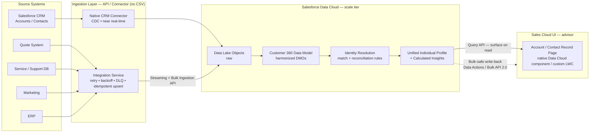
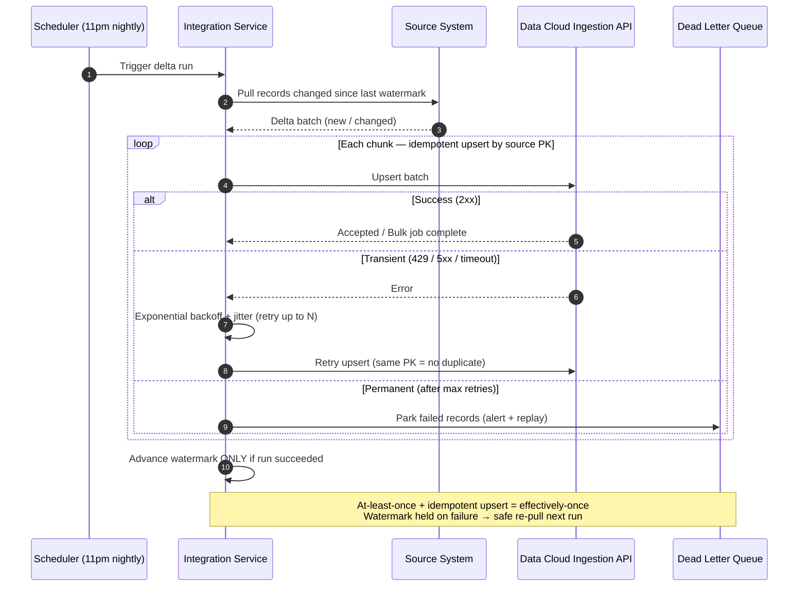

# Bedrock Badge — Customer 360 on Salesforce Data Cloud

> **Programmatic Development Bedrock badge** — design slide for a scalable Customer 360 solution on Salesforce Data Cloud.
> Structured as: 1. The Ask · 2. Solution · 3. Options Considered · 4. Trade-offs & Considerations.
> Emphasis: **scalability, performance, error handling, retry** + bulk-safe write-back to core Salesforce.
>
> *Diagrams are Mermaid — open in a Mermaid-capable viewer (VS Code preview / Notion / GitHub) and export each to PNG/SVG for the slides.*

---

## 1. The Ask

**Build a unified 360° customer profile in Salesforce Data Cloud.**

- **Consolidate** high-volume data (millions of records) from disparate systems — Salesforce CRM (Accounts/Contacts), back-end **quote** system, **service/support** DB, **marketing** & **ERP** — into one Customer 360 profile.
- **Resolve identity**: merge duplicates and link records for the same customer across systems; handle conflicting attribute values.
- **Map consistently** into the Customer 360 Data Model.
- **Keep fresh**: near real-time *and* efficient **nightly batches** (e.g., 11pm pull of records changed since last run).
- **Surface** the aggregated profile to advisors on the Account/Contact page in Sales Cloud.
- **Modern, robust integration**: API/connector approach (not CSV imports), with proper **error handling & retry**, **scalability/performance**, and **bulk-safe** write-back to core Salesforce.

> *Speaker notes:* Frame this as an enterprise integration + data-architecture problem, not a one-off load. The hard parts are (a) volume at scale, (b) correctness of identity resolution, and (c) protecting core Salesforce governor limits when data flows back. I'll keep referring back to those three throughout.

---

## 2. Solution

**A hybrid, API-first pipeline that does the heavy lifting in Data Cloud (the scale tier) and keeps core Salesforce thin.**

**A. Ingest (API/connector, never CSV)**
- **Salesforce CRM → native Salesforce CRM Connector** — CDC-driven, near real-time, zero custom code for Accounts/Contacts.
- **Quote / Service / Marketing / ERP → Ingestion API**, wrapped in a robust **Integration Service**:
  - **Streaming endpoint** for hot, near-real-time deltas.
  - **Bulk endpoint** for the 11pm nightly load and initial backfill (millions of records).
  - For warehouse-style ERP, optionally a **zero-copy connector** (S3 / Snowflake) instead of copying data.
- **Incremental by watermark**: each run pulls only records changed since the last successful high-water-mark (LastModified timestamp) → minimal volume, fast runs.

**B. Harmonize & resolve (inside Data Cloud)**
- Land raw data in **Data Lake Objects (DLOs)** → map to standard **Customer 360 Data Model Objects (DMOs)**: Individual, Contact Point Email/Phone/Address, Account, Party Identification, Sales Order, etc.
- A shared **mapping standard / data dictionary** so every source maps consistently; normalize on the way in (lowercase email, E.164 phone).
- **Identity Resolution ruleset**:
  - **Match rules** — exact on normalized email/phone, party/external ID; fuzzy on name + address.
  - **Reconciliation rules** — resolve conflicts deterministically (most-recent-update wins, or source-priority, e.g., CRM > ERP per attribute).
  - Output = **Unified Individual profile** linking all source records.
- **Calculated Insights** compute aggregates (LTV, last quote, open cases) in Data Cloud — at scale, once.

**C. Surface in Sales Cloud (advisor view)**
- **Default — surface on read**: drop the **native Data Cloud profile/related-list Lightning components** on the Account/Contact record page, or a **custom LWC** that queries the Unified Profile + Calculated Insights live via the **Data Cloud Query/Connect API**. No data copied → no core storage or governor-limit cost.
- **Where offline/report access is needed — bulk-safe write-back**: push a *curated* subset of attributes/insights back via **Data Actions / Bulk API 2.0** (batched, async), never row-by-row DML or per-record callouts.

**D. Reliability (error handling & retry — built into the Integration Service)**
- **Idempotent upserts** keyed by stable source primary key → retries never duplicate.
- **Exponential backoff + jitter** on transient errors (HTTP 429 / 5xx / timeouts); **circuit breaker** on sustained failure.
- **Dead Letter Queue (DLQ)** parks records that fail after max retries — replay later, never lose data, never block the batch.
- **Async Bulk job status polling**; download and handle partial-failure results.
- **Watermark advances only on success** → a failed run safely re-pulls the same delta next time. *At-least-once delivery + idempotent upsert = effectively-once.*
- **Observability**: structured logs, ingest-vs-resolved reconciliation counts, alerts on DLQ depth / failure rate / rate-limit headroom.

> *Speaker notes:* The one-sentence thesis — "**Let Data Cloud hold the millions and do the joins; keep core Salesforce thin by surfacing on read and only writing back curated data in bulk-safe batches.**" The native CRM connector buys us near-real-time SF sync for free; the Integration Service exists for the systems that have no prebuilt connector, and that's exactly where we invest in retry/DLQ. Idempotent upsert is the keystone — it's what makes aggressive retries safe.

### Diagram 2.1 — End-to-end architecture

### Diagram 2.2 — Nightly ingestion with retry / backoff / DLQ

---

## 3. Options Considered

| # | Option | Pros | Cons | Verdict |
|---|--------|------|------|---------|
| **A** | **Hybrid: native CRM Connector + Ingestion API service** | Best of both — no-code CDC for SF; full retry/DLQ control for bespoke systems; scales | Two patterns to operate | ✅ **Recommended** |
| B | All systems via custom Ingestion API service | One uniform pattern; total control of error handling | Rebuilds what the CRM connector gives free; more code to maintain | Rejected — needless effort |
| C | Connector-only / no-code (CRM + S3/Snowflake) | Fastest to stand up; least code | Bespoke quote system has no connector; limited custom retry/DLQ | Partial — used inside A for ERP |
| D | iPaaS-centric (MuleSoft as backbone) | Enterprise-grade error handling, reuse, governance | Added licensing + platform; heavier | Strong alt if MuleSoft already owned |
| E | Manual CSV imports | Trivial to start | Not scalable, no automation, error-prone | ❌ Explicitly rejected by the ask |

**Surfacing sub-options:** native Data Cloud component *(low-code, recommended default)* vs. custom LWC via Query API *(more control)* vs. write-back fields *(enables reports/offline but consumes core storage + governor limits — use sparingly, always bulk-safe)*.

> *Speaker notes:* Lead with A. If asked "why not just MuleSoft (D)?" — great when the org already owns it; the architecture is the same, MuleSoft just replaces our custom service and adds cost/governance. Call out E as the anti-pattern the requirement explicitly rules out.

---

## 4. Trade-offs & Considerations

**Scalability & performance**
- Heavy lifting (joins, identity resolution, insights) runs **in Data Cloud**, the purpose-built scale tier — core Salesforce stays thin.
- **Incremental/delta loads** (watermark) over full reloads; **Bulk API** for nightly volume, **Streaming** for hot deltas; **bounded-concurrency** parallelism.
- **Identity Resolution is not instantaneous** — runs continuously/scheduled, so the unified profile lags ingest slightly. Set advisor expectations.

**Bulk-safe write-back & governance limits** *(the core-Salesforce risk)*
- Prefer **surface-on-read** → zero governor-limit / storage cost on core.
- When writing back: **Bulk API 2.0 / batched Data Actions**, async, never per-record DML/callouts. Test write-back at full volume against governor limits in a **full-size sandbox**.

**Error handling & retry**
- Idempotent upsert + retry/backoff + DLQ + watermark-on-success = no data loss, no duplicates, no stuck batches.
- Monitor DLQ depth, failure rate, and **Ingestion API rate-limit / Data Cloud credit consumption** as first-class signals.

**Data quality, conflicts & identity**
- **Match strictness is a balance**: too loose → false merges (two customers merged = privacy/data-quality incident); too strict → duplicates persist. Tune rules, review match rates, govern reconciliation (source-of-truth) rules.
- Garbage in → bad matches: normalize/standardize on ingest.

**Security, privacy & cost**
- Unifying PII into one profile raises **consent, data residency, and field-level security** on what advisors can see.
- Data Cloud is **consumption-priced (credits)** + storage; streaming and write-back add cost — design freshness to need (hot data streamed, the rest nightly).

**Testing strategy** *(badge-relevant)*
- **Identity resolution:** seed known cross-system duplicates → assert one Unified Individual; seed near-duplicates that must stay separate → assert no over-merge; assert conflicting attribute resolves to the expected winning value.
- **Volume/perf:** load millions of records → measure ingest throughput, IR processing time, query latency.
- **Governance limits:** run write-back at volume → assert no governor-limit exceptions and Bulk API usage.
- **Error/retry:** inject 429/5xx/timeouts → assert backoff, retry, DLQ population, watermark held, and idempotent replay (no dupes).
- **Reconciliation:** source counts == ingested == resolved (within expected merge ratio).

> *Speaker notes:* If you only memorize three trade-offs: (1) **surface-on-read beats write-back** for protecting governor limits; (2) **identity-resolution strictness is a tunable risk**, not a set-and-forget; (3) **idempotency is what makes retry safe**. These map directly to the badge's scalability / performance / error-handling / retry rubric.
