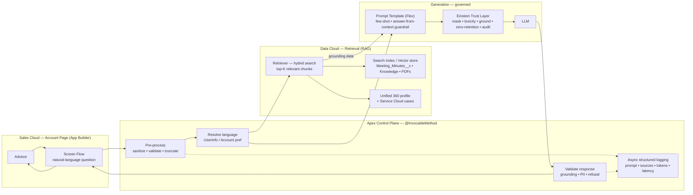
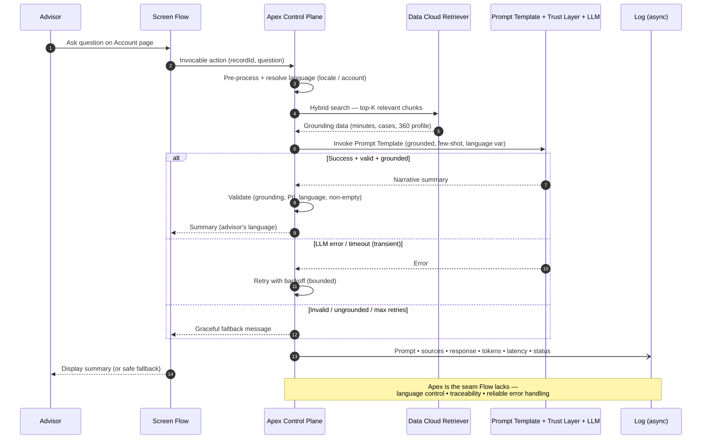

# Bedrock Badge — Section 7: AI Initiatives (RAG Advisor Assistant)

> **Programmatic Development Bedrock badge** — design slide for an AI-driven, RAG-based advisor assistant on Salesforce.
> Structured as: 1. The Ask · 2. Solution · 3. Options Considered · 4. Trade-offs & Considerations.
> Emphasis: **preserve declarative Screen-Flow simplicity** while adding **dynamic language control, operational visibility (logging/traceability), reliability/error handling, and hallucination prevention.**
>
> *Diagrams are Mermaid — open in a Mermaid-capable viewer (VS Code preview / Notion / GitHub) and export each to PNG/SVG for the slides.*

---

## 1. The Ask

**Give advisors an AI assistant that answers natural-language questions and summarizes a customer — grounded in the unified 360° data — using Retrieval-Augmented Generation (RAG).**

- Advisors ask things like *"What products has this client purchased in the last year and what's their support history?"* or *"Summarize this customer's engagement this quarter."*
- Behind the scenes: **retrieve** relevant data (unified profile in Data Cloud, related cases from Service Cloud, knowledge articles / PDF account plans), **construct a focused prompt**, and **call Generative AI** (Einstein GPT — now Einstein / Prompt Builder + Models API) to produce a coherent narrative answer.
- Must handle: **prompt size limits**, **relevance**, and **hallucination prevention** (prompt templates, few-shot examples, answer validation before display).
- Deployable by **admins via App Builder** on record pages, with configuration.

**The concrete situation to fix:** A **Screen Flow on the Account page** lets advisors ask about past meetings; it runs a **hybrid search over the custom `Meeting_Minutes__c` object** and feeds results into an AI prompt for a summary. Three gaps remain:
- **Dynamic language** — Prompt Templates invoked *directly from Flow* can't adapt the response language to user locale / account settings.
- **Control & visibility** — without Apex, there's no custom logging, robust error handling, or input pre-processing for accuracy and traceability.
- **UX risk** — inconsistent language or unhandled errors confuse advisors, hurt adoption, and surface incomplete/misleading summaries.

**Goal:** keep the **declarative simplicity of Screen Flows** while adding **language control, operational visibility, and reliability**.

> *Speaker notes:* The badge isn't asking "can you call an LLM" — it's asking you to productionize one. The three named gaps (language, visibility, reliability) are all symptoms of the same root cause: **a pure-Flow path has no code seam to insert control logic.** The whole solution is about adding that seam without throwing away the Flow.

---

## 2. Solution

**Keep the Screen Flow as the advisor's front door, but route AI generation through an Invocable Apex service that wraps a Data Cloud retriever + a governed Prompt Template. Apex becomes the control plane the pure-Flow path lacks.**

**A. Front door stays declarative (Flow + App Builder)**
- Advisor uses the existing **Screen Flow** on the Account page; it calls **one `@InvocableMethod` Apex action** (`recordId` + question in, summary + status out).
- Packaged as a Lightning component admins drop via **App Builder**, with **design attributes** (which Prompt Template, top-K, search object, language source, on/off citations) — admins keep control, no redeploys.

**B. Retrieve — RAG via Data Cloud hybrid search (relevance + prompt-size control)**
- Index `Meeting_Minutes__c` (+ Knowledge articles, PDF account plans) into the **Data Cloud Search Index / vector store**.
- A **Retriever** performs **hybrid search** (semantic + keyword) and returns only the **top-K relevant chunks** — this is what keeps the prompt focused *and* under size limits.
- Same step pulls structured context: recent transactions from the **unified 360 profile** and related **Service Cloud cases**.

**C. Generate — governed Prompt Template + Einstein Trust Layer (hallucination defense)**
- Apex invokes a reusable **Prompt Template (Flex type)** via **ConnectApi (`EinsteinLLM.generateMessagesForPromptTemplate`)** — grounding the retrieved data + question + **few-shot examples** + a hard guardrail: *"Answer only from the provided context; if it's not there, say so."*
- All generation flows through the **Einstein Trust Layer**: PII masking, toxicity detection, grounding, **zero data retention**, and an audit trail.

**D. The Apex control plane — exactly the gaps Flow can't close**
- **Dynamic language:** Apex resolves the target language deterministically from `UserInfo.getLocale()` / `getLanguage()` or the **Account's preferred-language** field, then injects it as a prompt variable → output always matches advisor/account language.
- **Operational visibility:** every call writes a **structured log** (prompt, retrieved sources, response, token count, latency, status) to a custom object / **Platform Event**, written **async** so it never blocks the advisor.
- **Reliability:** **input pre-processing** (sanitize, validate, truncate), **try/catch with retry + timeout** on the callout, **response validation** (empty / refusal / ungrounded / PII), and **graceful fallback** messages instead of raw exceptions.

> *Speaker notes:* One-line thesis — **"The Flow stays; Apex becomes the control plane that wraps a governed Prompt Template and a Data Cloud retriever."** The keystone insight: an Invocable Apex action is callable from Flow, so you lose *zero* declarative simplicity but gain a place to put language resolution, logging, validation, and error handling. RAG (retriever → grounded prompt → Trust Layer) is the hallucination defense; Apex is the operational defense.

### Diagram 2.1 — End-to-end architecture

### Diagram 2.2 — Request lifecycle (language · visibility · reliability)

---

## 3. Options Considered

| # | Option | Pros | Cons | Verdict |
|---|--------|------|------|---------|
| **A** | **Flow → Invocable Apex → Prompt Template + Data Cloud Retriever** | Keeps declarative Flow; Apex adds language/logging/validation/retry; Prompt Builder + Trust Layer stay governed; RAG via hybrid search | Apex to build & maintain (kept thin) | ✅ **Recommended** |
| B | Pure Flow → Prompt Template directly *(current state)* | Simplest; no code | **The failing baseline** — no dynamic language, no logging, no error handling/pre-processing | ❌ Root of the three gaps |
| C | Full custom LWC + Apex → Models API directly (`generateMessages`) | Maximum control; build prompt entirely in Apex | Loses declarative simplicity & Prompt Builder governance; most code to maintain | Overkill for this use case |
| D | Agentforce / Einstein Copilot agent with custom actions | Conversational, multi-turn, reusable actions; strategic direction | Heavier setup, different UX, added licensing; more than one summarization need | Strong future roadmap item |
| E | Call an external LLM from Apex (named credential, e.g. OpenAI) | Model flexibility | **Bypasses Einstein Trust Layer** → PII/compliance/audit risk | ❌ Rejected |

**Retrieval sub-options:** Data Cloud **Retriever / hybrid search** *(semantic + keyword, recommended — best relevance & prompt-size control)* vs. plain **SOQL/SOSL in Apex** *(simple, but keyword-only, weaker relevance)* vs. hand-rolled embeddings *(unnecessary — Data Cloud provides it)*.

> *Speaker notes:* Open by naming **B as the status quo that's failing** — it frames why A exists. A is "B plus a control seam." If asked about D (Agentforce): right long-term answer for a true conversational copilot, but for a single grounded-summary action it's heavier than needed — call it the roadmap. E is the compliance trap: never route customer PII to an external model outside the Trust Layer.

---

## 4. Trade-offs & Considerations

**Declarative simplicity vs. control** *(the core tension)*
- Apex adds the power Flow lacks — but also code to own. **Keep it thin:** one Invocable action, configuration via App Builder design attributes, generation logic in the Prompt Template (Prompt Builder), not hardcoded in Apex.

**Dynamic language**
- Apex resolves locale deterministically and passes it as a prompt variable. Decide the **source of truth** (running user vs. Account preferred language) and keep any **static scaffolding localized**; LLM translation quality varies by language — spot-check.

**Operational visibility**
- Log **async** (Platform Events / Queueable) so logging never blocks the advisor or burns transaction DML. Logs contain prompt/response → **mask sensitive data** and set a **retention policy**.

**Reliability & error handling**
- LLM callouts are **synchronous and latency-prone** — budget for an advisor waiting (spinner / async pattern), enforce **timeouts**, **bounded retries**, and respect **callout/governor limits**. Always return a **graceful fallback**, never a raw stack trace.

**Accuracy & hallucination**
- RAG grounding + Trust Layer + few-shot + "answer-from-context-only" + response validation **reduce, not eliminate** hallucination. **Show sources/citations**, add a disclaimer, and keep a **human in the loop** — the advisor reviews before relying on it.

**Prompt size & relevance**
- Tune **top-K**, chunk source documents sensibly, and **budget tokens**; for very large histories, **summarize-then-summarize** (map-reduce) to stay within limits.

**Security & trust**
- Keep generation inside the **Trust Layer** (masking, zero-retention, audit). Enforce **FLS/sharing in retrieval** (`with sharing`). Defend against **prompt injection** — sanitize the advisor's question *and* treat retrieved content as untrusted (instruction defense).

**Cost & scale**
- Each generation consumes **Einstein requests/credits**; hybrid search + embeddings add cost. **Cache** repeat questions where sensible; the retriever scales in Data Cloud while Apex stays thin.

**Testing strategy** *(badge-relevant)*
- **Language:** users/accounts in different locales → assert the response language matches the resolved source.
- **Visibility:** assert every call writes a log (prompt, sources, tokens, latency, status); force an error → assert it's logged *and* a friendly message is shown.
- **Reliability:** inject LLM timeout/5xx → assert bounded retry + fallback, no unhandled exception, no governor-limit breach.
- **RAG accuracy:** seed meetings with known facts → ask → assert the summary is grounded and cites sources; ask about absent info → assert "no information found", **not** a hallucination.
- **Prompt size:** huge meeting history → assert top-K / token budgeting keeps the request within limits.
- **Security:** inject a prompt-injection string in the question and in a meeting note → assert the guardrails hold and no PII leaks.

> *Speaker notes:* The three trade-offs to memorize: (1) **the Invocable Apex seam is what buys language + logging + reliability without losing the Flow**; (2) **RAG + Trust Layer + validation makes the AI trustworthy, but keep the advisor in the loop**; (3) **log async and stay inside the Trust Layer** — the two easiest ways to turn a demo into a production incident. These map directly to the badge's language / visibility / reliability rubric.
